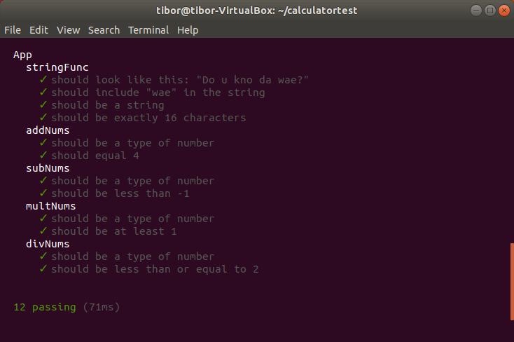
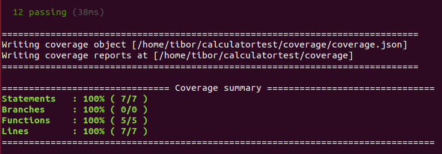
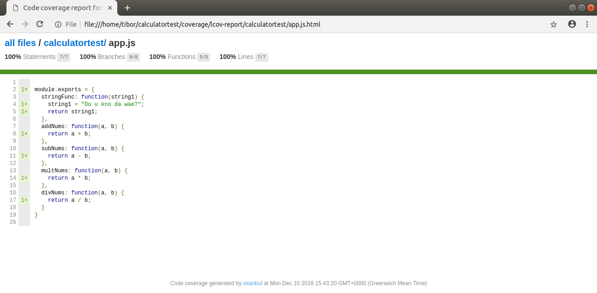

Unit tests of a simple calculator and string function
===

About
---
I wanted to utilise existing knowledge to use Mocha and Chai to do more unit tests. 
Furthermore, I wanted to explore other options, such as other Chai assertions and code coverage.

Technologies
---
- NodeJS: to create a simple application
- MochaJS: to provide testing structure
- Chai: to provide assertions functions
- Istanbul: to track statements, branches, function coverage and line coverage
- Travis-CI: to test and build projects hosted at GitHub.

Screenshots:
---
- Unit tests: 
  

- Coverage summary report: 
  

- Coverage summary (html): 
  
